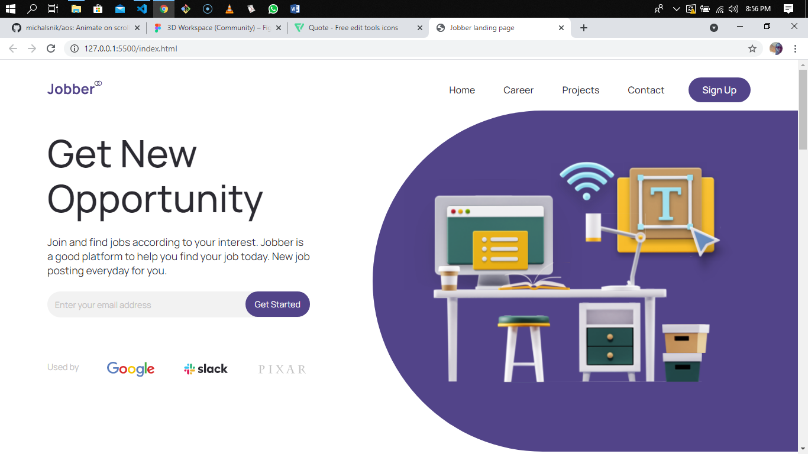

# Jobber landing page solution

This is a Frontend design of the landing page [David Ironali](https://www.linkedin.com/in/david-ironali-111878199/) posted on [LinkedIn](https://www.linkedin.com/posts/david-ironali-111878199_uiuxdesign-landingpage-landingpagedesign-activity-6791660657956810752-SwBh) a couple of weeks ago.

## Table of contents

- [Overview](#overview)
  - [The Project](#the-project)
  - [Screenshot](#screenshot)
  - [Links](#links)
- [My process](#my-process)
  - [Built with](#built-with)
  - [What I learned](#what-i-learned)
- [Author](#author)
- [Acknowledgments](#acknowledgments)

## Overview

### The Project

Users should be able to:

- View the optimal layout for the site depending on their device's screen size
- See hover states for all interactive elements on the page
- See an animation of the page content on scroll.

### Screenshot



### Links

- [Live site URL](https://jobber-landing-page.vercel.app/)

## My process

### Built with

- Semantic HTML5 markup
- CSS custom properties
- Flexbox
- Desktop-first workflow
- Vanilla JavaScript
- Animate on Scroll library

### What I learned

Building this project, I have been able to work on my frontend development skills which includes:

- Responsive web design
- CSS custom properties
- Using Js for mobile navigation toggle

the project has also gave me a chance to try out a new library I just learnt [AOS](https://github.com/michalsnik/aos)


Below is a code snippet of how I was able to implement the AOS library.

```html
  <div class="footer-col" data-aos="fade-up" data-aos-offset="100" data-aos-duration="1000" data-aos-delay="1500">
```

```JavaScript
  <script src="https://unpkg.com/aos@next/dist/aos.js"></script>
  <script>
    AOS.init();
  </script>
```

```CSS
  <link rel="stylesheet" href="https://unpkg.com/aos@next/dist/aos.css" />
```

## Author

- Github - [uzoway](https://github.com/uzoway)
- LinkedIn - [Uzochukwu Victor Okafor](https://www.linkedin.com/in/uzochukwuokafor/)

## Acknowledgments

My gratitute goes to [David Ironali](https://www.linkedin.com/in/david-ironali-111878199/) for allowing me use the design to build out this project.
